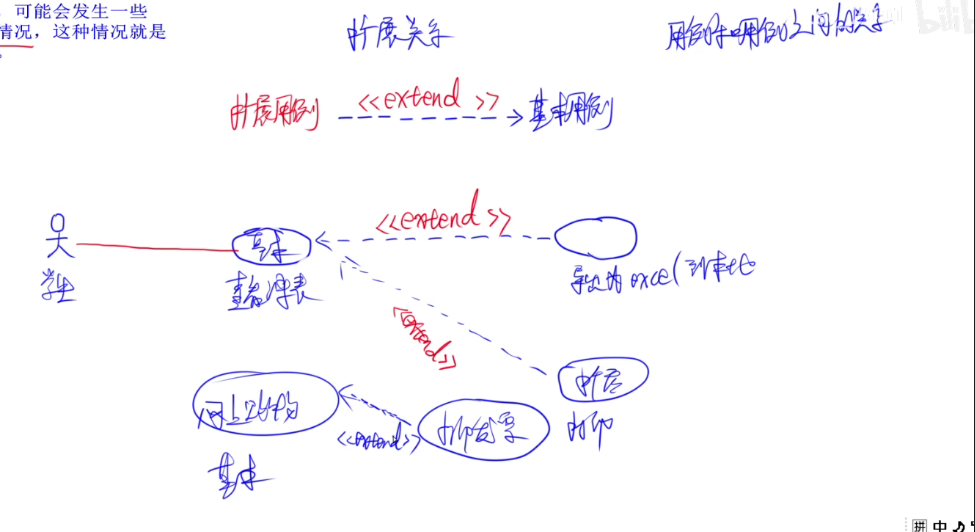

# 第一章--计算机系统硬件基本组成
计算机系统基本硬件：运算器，控制器，存储器，输入设备，输出设备

- 时间控制+数据处理--》运算器
- 程序控制+操作控制--》控制器

## 运算器+控制器
**运算器：**
要求：完成运算
时间控制+数据处理：时间控制体现在

1. **算术运算：** +-*/
2. **逻辑运算：** 与或非，零值测试，两个值的比较
### 运算器的组成部件：

1. **算术逻辑单元ALU：** 处理数据，实现算术运算和逻辑运算
2. **累加寄存器AC：** 累加器，为ALU提供一个工作区，暂存运算结果
3. **数据缓冲寄存器QR：** 暂存要读写的数据，是CPU和内存/外部设备数据传送的中转站
4. **状态条件寄存器PSW：** 状态标志：控制标志：进位，溢出，结果0，结果负，中断，方向，单步等

---

**控制器：**
> 控制整个CPU的工作，决定了计算机运行的自动化

**要求：** 保证程序的正确执行，处理异常事件。

1. **指令寄存器IR：** 存储指令，指令译码器根据IR内容产生各种微操作指令，控制其他组成部件工作（内存-缓冲寄存器-IR）
2. **程序计数器PC：** 也称指令计数器，存储存储单元的地址。顺序执行和转移执行。【程序猿可访问！！！】

顺序执行：存起始地址到PC，+1依次访问。
转移执行：+x向前或后访问。

3. **地址寄存器AR：** 保存CPU当前访问的**内存单元** 的地址，由于内存和CPU的操作速度差异。
4. **指令译码器ID：** 指令包含操作码和地址码，为了执行任意指令，必须对操作码进行分析。

程序猿可以直接访问通用寄存器来存取数据，也可以访问状态条件寄存器来获取有关数据处理结果的相关信息，可以通过相对程序计数器来寻址，但是不能访问指令寄存器
### 运算器+控制器-错题：

1. 
2. 

---

## 计算机基本单位
位（比特）= b = bit
       |*8
字节 = byte = B
       |*1024
千字节-1K = 1024B = 2^10B
兆字节-1MB = 1024KB
吉字节-1GB = 1024MB
太字节-1TB = 1024GB
最小的数据单位：b
最小的存储单位：byte
### 二，八，十，十六进制
进制转换（小-大/大-小）
进制加减：加-逢n进1    减-不够+n-借位-1
应用题：

### 应用题-错题：

1. 

## 原码，反码，补码
原码：二进制数，最高位符号位【eg：-3=10000011】
反码：正数不变。最高位不变，复数取反，
补码：反码+1【好处：简化计算机运算部件的设计】
移码：补码的符号位取反
【注意】：

1. 正数的 -->原码=反码=补码
2. 【[x]补】补 = [x]原

机器字长为n时，各种码制表示的带符号数的范围
 

| 码制 | 定点整数 | 定点小数（不占存储位） |
| --- | --- | --- |
| 原码 | -127~127 |  |
| 反码 | -127~127 |  |
| 补码 | -128~127 |  |
| 移码 | -128~127 |  |

0.1234x10^2：阶码E=2  尾数F=4
浮点数：用阶码和尾数表示的数，称浮点表示法。
浮点数的**阶码**决定数的范围，**尾数**决定数的精度【最好是小阶向大阶对齐，即尾数向右移n位】
阶码越大-》表示的范围越大；尾数越多--》表示的精度越大
规格化：充分利用尾数类来表示更多有效数字，采用规格化浮点数，即，将尾数的绝对值限定在[0.5,1]之间

任意一个二进制 : N=2^E xF

### 错题：

1. 
2. 
## 寻址
目的：扩大寻址空间，提高编程灵活性

- **立即寻址【最快1】：** 操作数包含在指令中
- **直接寻址【3】：** 操作数存放在内存单元中，指令中直接给出操作数所在存储单元的地址
- **寄存器寻址【2】：** 操作数存放在某一寄存器中，指令中给出放操作数的寄存器
- **寄存器间接寻址【4】：** 操作数存放在内存单元中，操作数所在存储单元的地址在某个寄存器中
- **间接寻址【5】：** 指令中给出操作数地址的地址
### 错题：

1. 
2. 
3. 
## 奇偶校验码
**奇校验：** 添一位0/1，使1的个数为奇数
**偶校验：** 添一位0/1，使1的个数为奇数
**码距：** 为2 eg：1 00   1 11 --0+1+1=2
## 海明码
**码距：** 3
**数据位：** n位  校验位：k位   则2^k-1>=n+k
**作用：利用奇偶性** 检错，纠错
## 循环校验码
**作用：** 可以检错，不能纠错
**码距：** 2
模2运算，k个数据位，r个校验位

若有奇数个 数据为出错，则可以i检测出该错误，但无法纠正错误

## RISC+CISC
RISC：精简指令计算机

CISC：复杂指令计算机

## 指令流水线
**流水线时间** = 第一条指令的执行时间+(n-1)*最长时间段
**加速比** = 	不采用流水线/采用流水线
**操作周期** = 最长时间段
**吞吐率** = 单位时间输出结果的数量（eg：=10条/3s）
**n条指令的吞吐率** = n/[第一条指令的执行时间+(n-1)*最长时间段]

**最大吞吐率** ：取决于流水线中最慢一段时间所需的时间。
如果出现**断流**，则加速比会明显下降【但是，加速比越大越好】
要使**加速比和效率最大化**应该对流水线各级采用相同的运行时间
流水线：采用异步控制不会提高性能

## 存储器的分类
存储器**位置**分类：内存+外存
存储器**构成材料**分类：磁存储器+半导体存储器+光存储器
存储器的**工作方式**分类：读写RAM+只读ROM
**相联存储器**：是一种按内容访问的存储器
存储器的**寻址**方式：随机存储器+顺序存储器+直接存储器
常用的**虚拟**存储器：主存+辅存
**主存**：DRAM动态随机存储器【周期性刷新】
**闪存【u盘】**：掉电后信息不会丢失，属于非易失性存储器。以块为单位进行删除。

**高速缓存：** 存放最活跃的程序和数据，位于CPU和主存之间，比主存快，对程序员是透明的。由高速缓存cache，主存，CPU组成。
Cache用来存放主存的部分拷贝信息。提高命中率
**命中率** 和时间复杂度没关系，替换算法才影响命中率

**块冲突次数：** 全相联映像<组相联映像<直接映像
**Cache与主存的地址映像**由专门的硬件自动完成

## 中断
暂停正在运行的，转去执行有关服务，处理完自动返回源程序
**中断向量：** 提供中断服务程序的入口地址
**中断响应时间**：发出中断请求开始，到进入中断服务程序
**保存现场**：返回来执行源程序【堆栈】，目的：能正确返回被中断的程序继续执行

## 输入输出（I/O）控制方式

1. 程序查询方式【只能串行工作】
2. 中断驱动方式【可并行工作】
3. 直接存储器方式DMA【可并行操作。尽在传输数据块的开始和结束才需要CPU干预。由外设直接将数据放入内存[主存]】

CPU是在一个总线周期结束时响应DMA请求的
采用DMA传送数据时，没传送一个数据都需要占用一个存储周期
## 总线结构
包括数据总线，地址总线，控制总线

PCI总线是并行内总线,SCSI是并行外总线

## 加密技术+认证技术
窃听
篡改
假冒
否认

**加密技术：**

1. **对称加密【私钥，私有密钥加密，共享密钥加密】**：加密和解密是同一把密钥

密钥分发有缺陷：加密速度很快．适合大量明文数据
算法：DES，3DES，RC-5，IDEA，AES，RC4

2. **非对称加密【公钥，公开密钥加密】**：加密解密不是同一把密钥，公钥和私钥,无法通过一个推出另一个

密钥分发没有缺陷：加密解密很慢
算法：RSA，ECC，DSA
-----------------------------
Hash函数，MD5摘要算法，SHA-1安全散列算法

**混合加密**: 第一步，数据发送者A使用对称密码对要发送的消息进行加密
第二步，A使用B的公开密钥对对称密钥进行加密，形成数字信封。再将数字信封和加密的信息传给B
第三步，B收到加密数据和数字信封后，用自己

**认证技术：数字认证**
**CA**是一个**权威机构**。**用户**向CA机构申请数字证书将**个人信息和公钥**发给CA机构CA机构颁给用户数字证书，**数字证书**用**CA的私钥**进行**签名（加密）**用CA的公钥**验证（解密）**数字证书得到**用户的公钥**

**主动攻击 ：**
是会导致某些数据流的篡改和虚假数据流的产生的网络攻击。这类攻击可分为篡改、伪造消息数据和终端（拒绝服务）。

**被动攻击：**
是攻击者不对数据信息做任何修改，通常包括**窃听、流量分析、破解弱加密**的数据流等攻击方式。

**认证**是处理**主动攻击（篡改**）,
**加密**处理**被动攻击(监听**)
### 错题：

1. 
2. 
3. 
4. 
5. 
6. 
7. 
8. 

## 可靠性公式
串联：R= R1R2R3...Rn
并联：R=1-(1-R1)(1-R2)...(Rn)

## 第一章末尾：【可以不看】

1. 
2. 
3. 
4. 
5. 
6. 
7. 
8. 
9. 

## 二--程序设计语言
### 低级语言+高级语言
机器语言【低级语言】+汇编语言+程序设计语言【高级语言】
### 编译程序+解释程序
**解释器：**
翻译源程序时**不生成**独立的目标程序
解释程序和源程序要**参与到程序的运行过程中**

**编译器:**
翻译时将源程序翻译成**独立保存**的目标程序
机器上运行的是与源程序等价的目标程序
源程序和编译程序都**不再参与目标程序的运行过程**

程序中的**数据必须有类型**：

1. 便于为数据合理分配存储单元
2. 便于对参与表达式计算的数据对象进行检查
3. 便于规定数据对象的取值范围及能够进行的运算

### 错题：

1. 

## 函数
函数包含：首部+结构体
描述了：做什么+怎么做
**传值调用：**
将**实参**的值**传递给形参**，实参可以是变量、常量和表达式。
不可以实现形参和实参间双向传递数据的效果。

**传引用（地址）调用：**
将**实参**的地址**传递给形参**，形参必须有地址，实参不能是常量（值），表达式。
可以实现形参和实参间双向传递数据的效果，即改变形参的值同时也改变了实参的值。
### 错题：

1. 

## 编译，解释程序，翻译阶段

## 符号表：
不断收集、记录和使用源程序中一些相关符号的类型和特征等信息，并将其存入符号表中。记录源程序中各个字符的必要信息，以辅助语义的正确性检查和代码生成。

## 词法分析：
输入：源程序；输出：记号流
词法分析阶段的主要作用是：分析构成程序的**字符**及由字符按照构造规则构成的符号**是否符合程序语**
## 语法分析：
输入：记号流；输出：语法树（分析树）
语法分析阶段可以发现程序中所有的语法错误
语法分析阶段的主要作用是：对各条**语句的结构**进行**合法性分析**分析程序中的**句子结构是否正确**
## 语义分析
输入：语法树对（分析树）
语义分析阶段的主要作用是：进行**类型分析和检查**
语义分析阶段不能发现程序中所有的语义错误
语义分析阶段**可以发现静态语义错误**，不能发现动态语义错误，**动态语义错误运行时才能发现**

## 目标代码生成
目标代码生成阶段的工作与具体的机器密切相关
**寄存器的分配工作**处于**目标代码生成阶段**

### 错误:

1. 
2. 
3. 

## 中间代码生成
常见的中间代码有：**后缀式、三地址码、三元式、四元式和树**（图）等形式。
中间代码与具体的机器无关（不依赖具体的机器），可以将不同的高级程序语言翻译成同一种中间代码。**中间代码**可以**跨平台**。
因为与具体的机器无关，使用中间代码有利于**进行**与**机器无关的优化处理**和**提高编译程序的可移植性**

## 正规式

### 错题:

1. 

## 有限自动机
有限自动机是**词法分析**的一个工具，它能正确地识别正规集
**确定的有限自动机（DFA）：**对每一个状态来说识别字符后转移的状态是唯一的**(比如 : 0状态有一种方法或者0状态有一种方法+1状态有一种方法)**
**不确定的有限自动机（NFA）：**对每一个状态来说识别字符后转移的状态是不唯一的

## 上下文无关文法

1. 
2. 

## 后缀式+中缀式
就相当于：后序遍历+中序遍历
**后缀式【逆波兰式】：**a？b--ab？
**中缀式：**a？b
优先级相同时，从右向左计算
（）-->--且--或
## 第二章末尾【可以不看】：

1. 
2. 
3. 
4. 
5. 
6. 
7. 
8. 
9. 
10. 
11. 
12. 
13. 
14. 
15. 
16. 
17. 
18. 
19. 
20. 
21. 
22. 
23. 
24. 
25. 
26. 

# 第三章--下午题目--数据流图
## 数据流图

### 外部实体：【是唯一的】

### 数据存储：

### 加工:

### 数据流：【至少有一个是加工】

### En的名称：
说明中找实体

### Dn的名称：
根据xxx+表/文件

### 父图子图平衡1
基本上父图有的子图都有，
若子图没有则**数据流缺失，需要添加**

### 加工既有输入流也有输出流2
若**没有输出**或者**没有输入**，则**需要添加**

### 数据守恒3
看**加工的功能**和**文字描述**的**是否一致**？
3--p25

# 第四章--知识产权
## 工业产权
注册商标
申请专利
## 著作权【中华人名共和国著作权法】
人身权【**发表权**--**有时间限制**，**署名权**，**修改权**，**保护作品完整权**】
+
财产权

### 错题：

1. 
## 地域性
在哪里申领，受哪里保护
## 计算机软件保护条例

### 错题：

1. 

## 职务作品
公司职员只有署名权
如果用了公司的东西，研究出来的作品，不能属于雇员个人享有
### 错题：

1. 

## 委托开发的软件著作权归属

### 错题：

1. 

## 商业秘密权

## 专利权申请

## 商标权

### 错题：

1. 
2. 
3. 
4. 

## 商标注册

1. 先注册显得。
2. 同时注册，先使用先得。
3. 协商/抽签获得

## 第四章末尾

1. 
2. 
3. 
4. 
5. 
6. 
7. 
8. 

# 第五章--数据库
## 概念数据模型
信息=数据+数据处理
数据模型：实体类型及实体间联系的模型
数据模型：

- 概念数据模型：E－R图

三种联系：１－１　／　１－ｎ　／　ｎ－ｎ
实体名－矩形框，属性－椭圆框，联系－菱形框，彼此间用无向边连接

- 结构数据模型：层次，网状，关系，面向对象模型

## 三级模式结构
概念模式/模式：基本表

外模式：视图

内模式：存储文件
## 两级映像

### 错题:

1. 

## 关系模型基本术语

## 完整性约束

## 并,差,交,笛卡尔积

## 投影,选择

## 连接
>/</<=/>=/=
### 
等值连接--=

自然连接--去重

### 错题：

1. 
2. 
3. 
4. 

## 投影选择转化为SQL
 投影：

选择：

## 笛卡尔积转化为SQL

## 自然连接转化为SQL

### 错题：

1. 

## MYSQL

## 

## insert

## delete

## DISTINCT【去重】

## AS

## 字符串匹配查询

## 集合的比较运算

## 逻辑组合运算

## 排序

## 聚合函数

## 表的连接查询

### 内连接
inner join

等值连接

非等值连接

自连接

### 外连接
左外连接：

右外连接：

全外连接

## 一般子查询
例题：

## SQL控制语句

授权：

收回权限：

## 视图的创建与删除

**视图**是**虚拟表**：对视图的操作，实际是对实体表的操作，视图不会改变值
 p.63
### 错题：

1. 
2. 
3. 
## 索引

### 错题:

1. 
2. 
3. 

# 第七章--面向对象
## 面向对象+面向过程
面向对象：注重对象
面向过程：注重过程
## 类
**实体类**：应用领域的核心类，一般用于保存系统中的信息以及提供针对这些信息的相关处理行为。
**接口（边界）类**：是系统内对象和系统外参与者的联系媒介。
**控制类**：主要协调上面两个类对象之间的交互。控制活动流，充当协调者

### 错题:

1. 
2. 

## 对象

一个对象，通常包括对象名，属性（状态），方法
## 消息

### 错题：

1. 

## 重载
重载：多个同名，但是参数类型不同的方法
## 封装
（信息隐蔽技术）
封装：把一个对象的属性和行为封装成一个整体
目的：把使用者和生产者分离开

错题：

1. 
2. 
3. 
4. 
5. 

## 继承

### 错题：

1. 
2. 
3. 
4. 

## 多态

### 错题：

1. 

## 动态绑定

## 面向对象设计原则

 
### 错题:

1. 
2. 
3. 

## 面向对象分析

## 面向对象设计

## 面向对象测试

### 错题：

1. 
2. 
3. 

## 面向对象程序设计

### 错题:

1. 
2. 
3. 因为静态的内容会比非静态的先加载进内存，所以静态不能访问非静态，但非静态可以访问静态
4. 
5. 
6. 
7. 
8. 
9. 

**抽象类**是**斜体**

# 第八章--UML

## 结构事务

## 行为事务

## 分组事务+注释事务

### 错题:

1. 

## 关系
### 依赖

### 关联

### 泛化
是子类继承父类的反推--父类泛化子类

### 实现

#### 错题：

1. 
2. 
3. 
4. 
5. 
6. 
7. 
8. 

## UML中的图

### 类图

#### 错题：

1. 
2. 
3. 
4. 
5. 

## 对象图

### 错题:

1. 
2. 
   

## 用例图

### 包含关系

**用例**和**用例**之间的关系

一个用例包含另一个用例 ，即，==先执行右边，才可以执行左边==

.png](./imags/.png)

### 扩展关系

一个用例执行的时候，可能会发生一些特殊的情况或可选的情况，这种情况就是这个用例的扩展用例。

### 泛化关系

